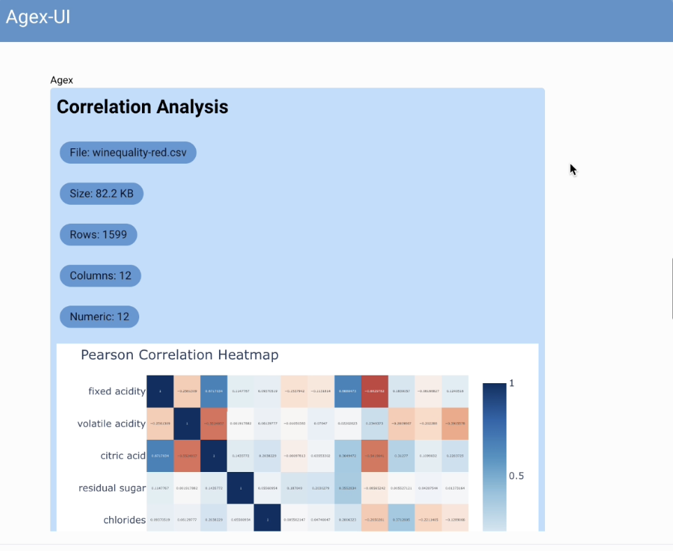
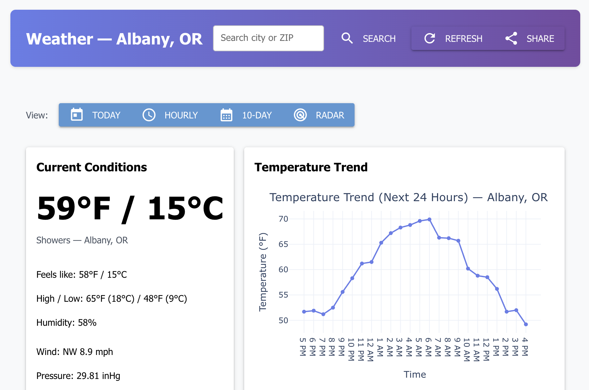

# Deep Dive: Building an Agent-Driven UI with `agex-ui`

Recently I open-sourced `agex`, an agentic framework that makes it easier for an agent to interact with existing Python libraries without tooling abstractions. I created an assortment of small [examples](https://ashenfad.github.io/agex/examples/overview/) but I also wanted a stand-alone app as a bigger demonstration.

I figured I'd start with an agent chat interface and try to fold in some interesting capabilities (like [routing](https://ashenfad.github.io/agex/examples/routing/)). But then I came across [NiceGUI](https://nicegui.io/) and realized that an integration with a Python-based front-end could be even more fun. So I went with that and built [`agex-ui`](https://github.com/ashenfad/agex-ui).

Integrating with `NiceGUI` meant using `agex` a little differently than I expected (more on this later) but I'm happy how it turned out. The agent lives in-process with the UI and can create components on the fly based on user prompts (or their interactions with components).

I built two demo apps and while they're admittedly toys, I think they do a good job at highlighting the potential.

## Chat

The `chat` app has the familiar agent/user chat framing. But the agent responds not through markdown but through building UI components in its response bubble. That means it can make interactive charts, simple games (like memory matching cards), or forms to capture structured data from the user.

Video:

<a href="https://youtu.be/-LaY_QBfkf8">
  
</a>

!!! note "A Note on the Demo Video"
I used GPT-5 with medium thinking and its not speedy, so I edited liberally. I've also tried it out with GPT-5-nano. The results aren't quite as pretty but the wait isn't nearly so painful.

## Lorem-Ipsum

The `lorem-ipsum` app is a bit simpler but also fun. The user input is only the url path. Try `http://.../nba/blazers/2032/roster` and you'll see players from the future. Visit `http://.../weather/albany/or` and you'll see some not-so-accurate weather forecasts.



# How Does It Work?

An `agex` agent "thinks-in-code" when it takes an action. From the agent's perspective, it lives in a REPL with a restricted set of Python capabilities. Its code is executed within a sandbox but it can share a process with regular Python.

!!! note
    Interested in more on this? Check out the [agex concepts](https://ashenfad.github.io/agex/concepts/overview/).

For the `agex-ui` agents, this means the agent generated code runs on the same process hosting the UI components over FastAPI endpoints. This keeps the friction low between the agent code and the UI state.

Let's make this a little more concrete by going through the details of the lorem-ipsum agent. We [create an agent](https://github.com/ashenfad/agex-ui/blob/fa97d610964d0819737d6662e814b36ad8aec23e/agex_ui/lorem_ipsum/main.py#L10-L18) 

```python
agent = Agent(
    name="lorem_ipsum",
    primer=PRIMER,
    llm_client=connect_llm(
        provider="openai",
        model="gpt-5",
        reasoning_effort="medium",
    ),
)
```

The [PRIMER](https://github.com/ashenfad/agex-ui/blob/main/agex_ui/lorem_ipsum/primer.py) is a document letting the agent understand its role and a few quirks of using NiceGUI within agex.

Now that we have this agent, we need to give it capabilities. This is a little like enumerating 'tools' except this is really lower-level access to Python fns, classes, or modules.

```python
register_stdlib(agent)
register_plotly(agent)

agent.module(nicegui, recursive=True, visibility="low")
agent.module(ui, recursive=True, visibility="high")
```

The `register_stdlib` and `register_plotly` are helpers but at they're core they're really just wrappers for `agent.module` registrations. Its a way to give an agent access to all the fns within a module.

Notice the `visibility` level. This is how we can control how much context we give to the agent about the fns and classes they can use. A "high" visibility means we'll
describe things like function signatures and function docs. "medium" is function signatures only and "low" means neither. "low" is useful for libraries that are well known and the LLM will already be familiar with.

But notice that we used "high" for the `nicegui.ui` sub-module. This is because its somewhat recent V2 is less familiar to our agents. So we want to capture those changes.

### The 400k Token Problem

This created a new, very practical problem. Some libraries have great built-in documentation. Perhaps a little too great.

The full documentation for `nicegui.ui` is massive. When rendered, it's nearly 400K tokens. Much of that documentation is likely repetitive redefinition of common params. Stuffing that all into our LLMs context is overkill. So while "high" visibility is a boon for small or succinct code bases it can be a problem for others.

But `agex` has another handy feature here: `summarize_capabilities`. It's a helper that uses an LLM to do a one-time, high-effort summarization of a library's API, creating a condensed "cheat sheet" that's much more token-efficient.

```python
# From agex_ui/chat/agent.py

# nicegui's ui module documentation is huge!
# We use a helper to summarize it into a smaller, cached primer.
cap_primer = summarize_capabilities(
    agent,
    target_chars=16000,
    use_cache=True, # cache so we only build this once
)
agent.capabilities_primer = cap_primer
```
I run this once, it [caches the result](https://github.com/ashenfad/agex-ui/blob/main/.agex/primer_cache/lorem_ipsum-9e54051c-ch16000-mgpt-4-1.md), and now my agent has a custom-made, token-friendly guide to NiceGUI that it can use for its work.

### The Agent's Real Job: Modifying Live UI

Now that the agent is set up, what does it actually *do*? This is where the workflow started to stretch in an interesting way. In most of my other `agex` examples, the agent is like a function: it takes data in and returns a new artifact (a plot, a function, a DataFrame). If the agent doesn't produce the right type, it gets scolded and asked to try again.

Here, the agent acts more like an actor with side-effects. Its task isn't to *return* a UI, but to *build* a UI inside a container that it's given from the host application. Side-effects like this wouldn't even be allowed if we used the optional `Versioned` state backend. But I'm ignoring the protests of the functional programmer in me. We're embracing the side-effects.

```python
# The task definition for the lorem-ipsum agent
@agent.task
def create_page(page: str, col: ui.column):
    """Create a realistic stand-in page via nicegui given the page name."""
    pass
```

Notice the `col: ui.column` parameter. When the `lorem_router` in `main.py` calls this task, it passes a live `ui.column` object directly to the agent. The agent's job is to call methods *on that object*, directly manipulating the application's state. It's not returning a description of a UI; it's building one in place.

### Making it Interactive: The `chat` App

The `lorem-ipsum` demo is fun, but the `chat` app is where this concept really shines. It introduces a closed loop where the agent can not only build UI, but also handle interactions with that UI.

This required solving one more puzzle: how can a button that the agent creates call back into the application to trigger another agent turn?

The solution was to create a simple Python function on the host side and register it with the agent. I called it `form_submit`.

```python
# From agex_ui/chat/main.py

@agent.fn
def form_submit(bound_vars: dict[str, Any]):
    """
    Use as a trigger for form submissions.
    """
    # ... logic to re-trigger the agent with the form data ...
    pass
```

With that function available, I could then coach the agent in its `PRIMER` to use it as the `on_click` handler for any buttons it creates. This allows the agent to generate code like this on the fly:

```python
# (Code the agent might generate)
with inputs.col:
    data_input = ui.input("Enter data source")
    
    # The agent composes a lambda that calls back to the host fn
    ui.button("Generate", on_click=lambda: form_submit({
        'data': data_input.value,
    }))
```

This is the key to the whole interaction. The agent builds a form, the user fills it out, and submitting that form calls a function that hands the data right back to the agent for the next turn. It's a complete, stateful, interactive loop built on a foundation of simple Python interoperability.

## Final Thoughts

Building `agex-ui` taught me a lot about what this style of agentic framework is capable of. Letting agents interact at a lower-level than "tools" doesn't just make it easier to work with existing libraries; it opens up new patterns of interaction. It's asking agents to do a lot more but they're proving to be capable.

